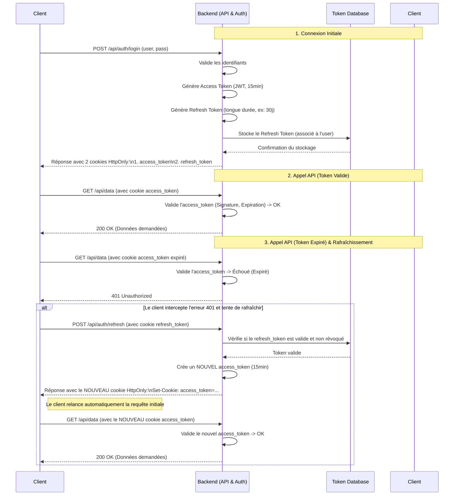

# Gestion des Tokens d'Authentification avec Cookies HttpOnly

> **Astuce :** Le diagramme de séquence est aussi disponible en version image (SVG) pour une intégration facile dans vos docs ou présentations :
>
> 

Ce document décrit le processus complet d'authentification et de gestion de session avec des tokens JWT (access_token et refresh_token) stockés dans des cookies HttpOnly.

## Diagramme de Séquence

Le schéma Mermaid est également disponible en version image SVG : **AUTH-TOKENS-COOKIES Mermaid Chart.svg**

## Explication du Schéma

Ce schéma se déroule en trois phases principales :

### 1. Connexion Initiale
- L'utilisateur envoie son nom d'utilisateur et son mot de passe.
- Le backend les vérifie.
- S'ils sont corrects, il génère deux jetons :
  - un `access_token` à courte durée de vie (ex: 15 minutes)
  - un `refresh_token` à longue durée de vie (ex: 30 jours)
- Le `refresh_token` est stocké dans une base de données pour pouvoir le révoquer en cas de besoin (ex: si l'utilisateur change son mot de passe ou si le jeton est compromis).
- Le backend envoie ces deux jetons au client sous forme de cookies HttpOnly pour une sécurité maximale.

### 2. Appel API (Token Valide)
- C'est le cas normal. L'utilisateur navigue dans l'application.
- Pour chaque requête vers une ressource protégée (ex: `/api/data`), le navigateur envoie automatiquement le cookie `access_token`.
- Le backend valide le jeton, voit qu'il est bon, et renvoie les données. C'est rapide et efficace.

### 3. Appel API (Token Expiré) & Rafraîchissement
- C'est le cœur du mécanisme qui évite à l'utilisateur de se reconnecter.
- L'utilisateur fait une action après 15 minutes. Le `access_token` envoyé est maintenant expiré.
- Le backend le rejette avec une erreur 401 Unauthorized.
- Une logique dans le code client (souvent un "intercepteur d'API") attrape cette erreur 401 spécifique.
- Au lieu de déconnecter l'utilisateur, il fait un appel silencieux à une route spéciale (`/api/auth/refresh`), en envoyant le `refresh_token` (qui lui, est toujours valide).
- Le backend vérifie ce `refresh_token` dans sa base de données. Si tout est en ordre, il génère un tout nouvel `access_token` et le renvoie au client.
- Le client reçoit ce nouveau jeton, le stocke, et relance automatiquement la requête qui avait échoué.
- Cette fois, la requête réussit.

Pour l'utilisateur, tout ce processus de rafraîchissement est complètement transparent. Il a simplement l'impression que sa session ne se termine jamais, tout en bénéficiant de la haute sécurité des jetons d'accès à courte durée de vie.

---

## Pour aller plus loin : options avancées

- **Rotation du refresh_token** : à chaque refresh, génère un nouveau refresh_token et invalide l’ancien (encore plus sécurisé).
- **Protection CSRF** : si tu utilises des cookies, pense à protéger les endpoints sensibles (ex : `/api/auth/refresh`) contre les attaques CSRF (token anti-CSRF ou SameSite=Strict).
- **Scopes/claims dans le JWT** : pour gérer les permissions fines et l’accès granulaire aux ressources.

---

## Table des Refresh Tokens

Il est indispensable d'avoir une table dédiée pour stocker les refresh tokens dans votre base de données (PostgreSQL, MySQL, etc.).

**Exemple de schéma de table : `RefreshTokens`**

| Nom du champ | Type SQL      | Description                                                        |
|--------------|--------------|--------------------------------------------------------------------|
| id           | SERIAL/UUID   | Identifiant unique pour chaque token                               |
| token        | VARCHAR       | Le hash du refresh token (ne jamais stocker le token en clair !)   |
| user_id      | INTEGER/UUID  | Clé étrangère vers la table Users                                  |
| expiration   | TIMESTAMP     | Date et heure d'expiration du refresh token                        |
| created_at   | TIMESTAMP     | Date de création (pour l'audit)                                    |

**Utilité de cette table :**
- **Déconnexion** : supprimer la ligne du refresh_token lors du logout rend le token invalide.
- **Sécurité** : en cas de changement de mot de passe, supprimer tous les tokens liés à l'utilisateur déconnecte tous ses appareils.
- **Validation** : lors d'une demande de refresh, le serveur vérifie le hash du token reçu dans cette table et s'il n'a pas expiré.

---

## Fonctionnement du JWT (JSON Web Token)

Le JWT est un jeton "stateless" (sans état) :
- **Le serveur ne stocke jamais l'access_token**.
- Toute l'information (identité, expiration, etc.) est contenue dans le jeton lui-même, signé cryptographiquement.

**Structure d'un JWT :**
- `xxxxx.yyyyy.zzzzz` (Header.Payload.Signature)
  1. **Header** : métadonnées (ex : type JWT, algo de signature)
  2. **Payload** : données (claims) :
     - `sub` : identifiant utilisateur
     - `exp` : expiration
     - `iat` : date de création
     - autres infos (rôles, scopes, etc.)
  3. **Signature** : hash cryptographique du header + payload, signé avec la clé secrète du serveur

**Validation d'un JWT :**
1. Le client envoie le cookie `access_token`.
2. Le serveur décode le JWT, recalcule la signature avec sa clé secrète.
3. Si la signature correspond, le jeton est authentique et non modifié.
4. Le serveur vérifie la date d'expiration (`exp`).
5. Si tout est OK, l'accès est accordé.

**Où sont stockés les tokens ?**
- `access_token` : uniquement dans le cookie HttpOnly du navigateur (jamais sur le serveur)
- `refresh_token` : dans le cookie HttpOnly ET dans la table `RefreshTokens` (sous forme de hash)

**Tableau récapitulatif :**

| Jeton           | Où est-il stocké ?         | Comment est-il validé ?                        | État      |
|-----------------|---------------------------|------------------------------------------------|-----------|
| **Access Token**| Cookie HttpOnly navigateur| Signature vérifiée par le serveur (clé secrète)| Stateless |
| **Refresh Token**| Cookie HttpOnly + DB      | Présence et validité dans la table DB          | Stateful  |

**Résumé :**
- Créez une table `RefreshTokens` pour la gestion des sessions et la sécurité.
- Ne stockez jamais l'access_token (JWT) sur le serveur : il est auto-validable grâce à sa signature.

---

## Choix du stockage des Refresh Tokens : PostgreSQL vs Redis

Deux solutions courantes pour stocker les refresh tokens : **PostgreSQL** et **Redis**.

### Option 1 : PostgreSQL (La solution simple et robuste)

- **Comment ?**
  - Créez simplement la table `RefreshTokens` dans votre base PostgreSQL principale, liée à la table `Users`.
- **Avantages :**
  - ✅ Simplicité : pas de nouvelle infrastructure à gérer.
  - ✅ Cohérence des données (ACID) : transactions atomiques (ex : suppression des tokens lors d'un changement de mot de passe).
  - ✅ Persistance garantie : les données survivent aux redémarrages.
- **Inconvénients :**
  - ❌ Performance (relative) : accès disque plus lent que la RAM. Pour la grande majorité des projets, ce n'est pas un problème.

### Option 2 : Redis (La solution haute performance)

- **Comment ?**
  - Stockez chaque refresh token comme une paire clé-valeur (ex : `refresh_token:<user_id>:<token_hash>`).
  - Utilisez la commande `EXPIRE` pour gérer la durée de vie.
- **Avantages :**
  - ✅ Performance extrême : accès en RAM, idéal pour un trafic très élevé.
  - ✅ Expiration native très efficace.
- **Inconvénients :**
  - ❌ Complexité d'infrastructure : il faut installer, configurer et maintenir Redis en plus de PostgreSQL.
  - ❌ Moins de garanties de persistance (par défaut) : risque de perte de tokens en cas de crash.
  - ❌ Pas de transactions relationnelles entre Redis et PostgreSQL.

---

### Recommandation

- **Commencez avec PostgreSQL** :
  - Solution simple, robuste, cohérente et largement suffisante pour 99% des projets.
  - N'ajoutez pas de complexité inutile tant que ce n'est pas nécessaire (principe **YAGNI** : "You Ain't Gonna Need It").
- **Quand passer à Redis ?**
  - Uniquement si, via du monitoring, vous constatez que la table `RefreshTokens` devient un goulot d'étranglement à très grande échelle.
  - C'est un problème de "luxe" qui n'arrive que sur des applications à très fort trafic.

**En résumé :**
- PostgreSQL est le choix par défaut, pragmatique et robuste.
- Redis est une optimisation de performance pour des cas d'usage à très, très grande échelle. 